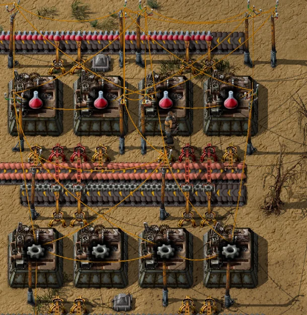
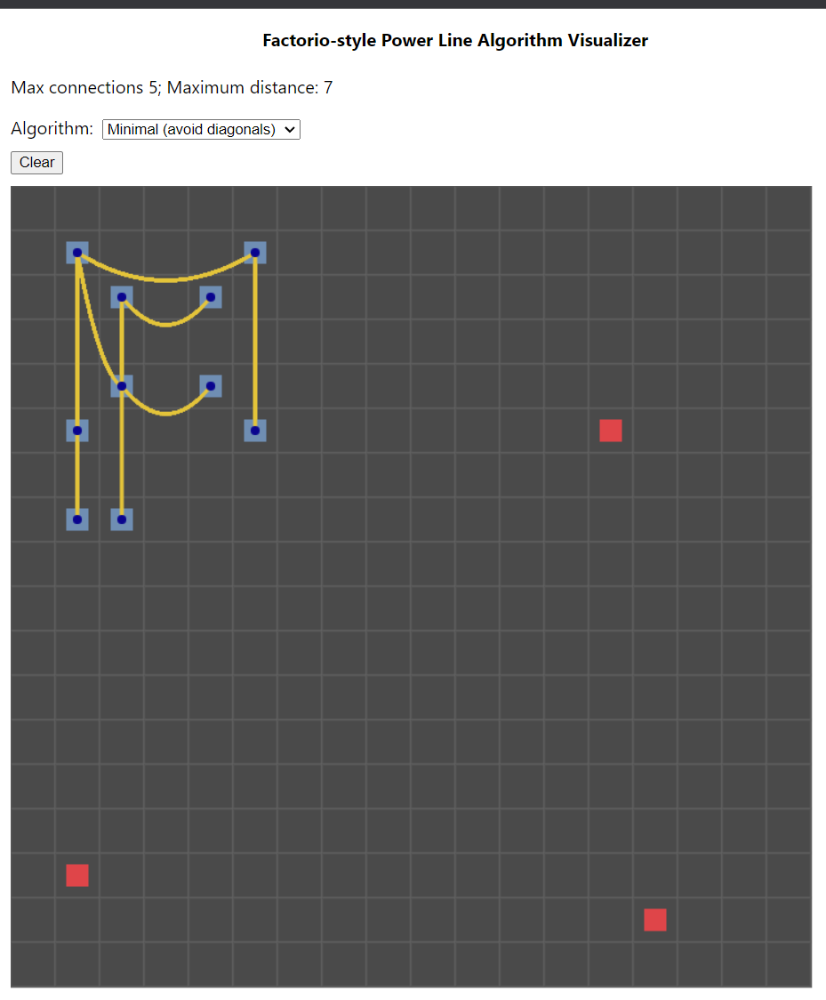

# Factorio power lines algorithm visualizer

Web app that visualizes and imagines Factorio-style power line connections if they could
use new, alternate algorithms to connect

## Why?

I love Factorio, a building and automation game. But one thing that has long bugged me about it
is that electric pole wire connections are generated in a way that leads to a mess. For example:

I'm not the only one who has been bothered by it. Other people have made mods to address the issue,
like: https://mods.factorio.com/mod/rewire-tool.

Furthermore, I've been doing a lot of LeetCode lately as I prepare for job interviews. So these
two things combined in my mind to make me wonder: how hard would it be to try other ways of connecting
the power poles to try to avoid unnecessary wiring that leads to a mess?

This project is the answer to that question. I challenged myself to use TypeScript, the Canvas HTML
element, React, and my own algorithm thinking to produce an interactive tool to visualize different
ways of connecting power poles.

I took a lot of inspiration from the game, including a limit of five connections per pole,
and a maximum of seven "tiles" of distance between connected poles.

## Screenshot

## Features

* Choose among four different algorithms, which will change how power lines are connected between the pole network
* To see power lines easier among a dense tangle of them, each power line connects with a slight "sag" and curve -- just like power lines in the real world!
* Place up to 324 power poles
* Each pole has a central "connector" object in dark blue that further helps clarify and reduce visual clutter
* Unconnected power pole nodes show up as red squares to indicate they aren't powered yet
* Clear the grid at any time to start fresh

## Setup

1. Install Node.js: https://nodejs.org/en
1. Use Git to clone this repo (i.e. the repo that contains the README you're reading now)
1. `npm install`
1. `npm start`

The last step will open a new browser tab pointed at `localhost:3000` with the app running

### Running tests

1. `npm test`
